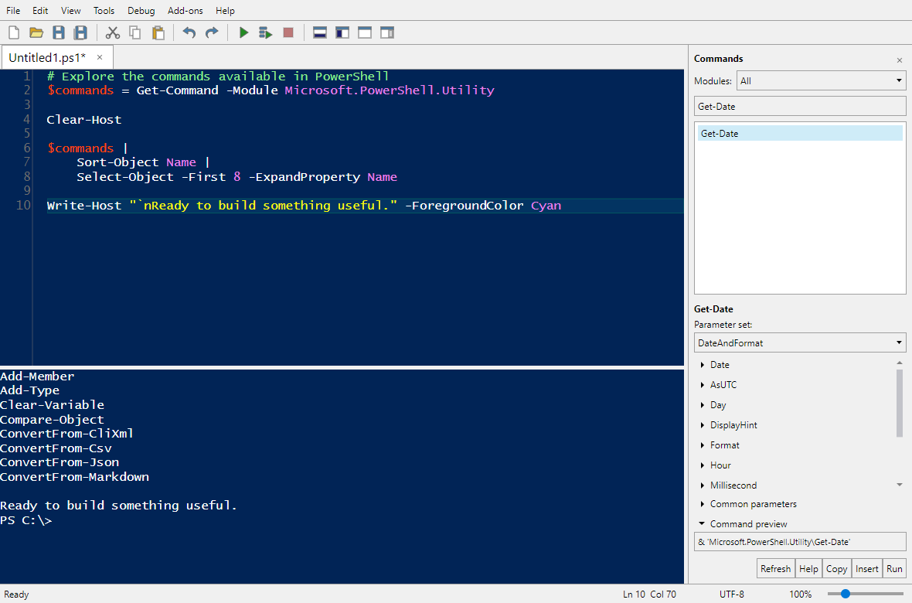

# Iseberg

A cross-platform desktop workbench inspired by PowerShell ISE, built with Avalonia, AvaloniaEdit, and PowerShell 7.6.6.



## Run

Install the [.NET 10 SDK](https://dotnet.microsoft.com/download/dotnet/10.0), then:

```powershell
dotnet run --project src/Iseberg
```

Open scripts from the command line:

```powershell
dotnet run --project src/Iseberg -- ./example.ps1
```

PowerShell is included through the SDK dependency; a separate `pwsh` installation is not required. Windows, Linux, and macOS are target platforms. Engine/headless desktop tests and publishing have been verified locally on Windows and Linux, and CI runs the same checks on all three platforms. Native desktop interaction has been exercised on Windows; native Linux/macOS desktop interaction has not yet been verified.

On Linux, use a graphical desktop with Avalonia's native dependencies (including X11, fontconfig, and OpenGL or software rendering). Native title bars, file pickers, available fonts, and platform-specific cmdlets necessarily differ by operating system.

## Use

The default view has a white script editor above the blue console, a Commands pane on the right, and the familiar menu, toolbar, file tabs, and status/zoom bar. The PowerShell session tab row appears when more than one session is open or a remote connection is active, so a single local session's script tabs sit directly beneath the toolbar.

| Action | Shortcut |
|---|---|
| New / open / save script | Ctrl+N / Ctrl+O / Ctrl+S |
| Save as / close script | Ctrl+Shift+S / Ctrl+W |
| New / close PowerShell tab | Ctrl+T / Ctrl+Shift+W |
| Run script / continue debugging | F5 |
| Run selection, or current line | F8 |
| Stop execution | Ctrl+Break or Shift+F5 |
| Toggle breakpoint | F9 |
| Remove all breakpoints | Ctrl+Shift+F9 |
| Break running script | Ctrl+Alt+Break |
| Step over / into / out | F10 / F11 / Shift+F11 |
| Completion / snippets | Ctrl+Space / Ctrl+J |
| Find / replace / go to line | Ctrl+F / Ctrl+H / Ctrl+G |
| Matching brace / select to matching brace | Ctrl+] / Ctrl+Shift+] |
| Script top / right / maximized | Ctrl+1 / Ctrl+2 / Ctrl+3 |
| Focus script / console | Ctrl+I / Ctrl+D |
| Clear console | Ctrl+L |

On macOS, Command is also accepted for the workbench shortcuts. Console Up/Down retrieves command history; Shift+Enter inserts a newline. Enter leaves syntactically incomplete commands open for more input. Each PowerShell tab has an independent persistent runspace, so variables, functions, current directory, and loaded modules survive successive commands without leaking into another tab.

The console is one text buffer and one scrollable editor: output, earlier commands, the prompt, and current input can be selected and copied together. Only the current input is editable; transcript text and prompt characters are protected from typing, deletion, paste, and automation writes. Enter on an earlier command recalls its code into the current input without executing it. Escape dismisses completion first, or clears input when no completion is open. Output/prompt updates reset console undo so undo cannot modify the transcript; script undo histories remain independent.

IntelliSense uses PowerShell completion in the active runspace. Automatic triggers include variables (`$`), command/parameter names (`-`), members (`.` / `::`), types (`[`), provider paths (`\` / `/`), and values after a parameter name and space. A new trigger refreshes an open list for the current context, such as switching from commands to parameters in `Get-Process -`. Parser context suppresses comments, literal strings, numeric decimal points, and arithmetic operators; expandable-string variables and subexpressions are supported. Ctrl+Space requests completion explicitly, even with automatic IntelliSense disabled. Console Tab / Shift+Tab cycles results when the completion list is closed. The timeout preference limits a completion query, rather than delaying its appearance.

**Replace** provides literal or .NET regular-expression matching, case and whole-word options, upward search, wrap-around, and a selection-only scope. Regex replacements support capture groups such as `$1` and `${name}`; literal replacements do not interpret dollar signs. Find Next, Replace Next, and Replace All stay available in one dialog, with explicit match/error feedback. Replace All is one undoable edit. Matching-brace navigation uses parser tokens, ignores braces in comments/literal text, includes nested subexpressions, and expands script folds when needed.

### Snippets

Ctrl+J opens a searchable catalog with descriptions, author information, and code previews. The catalog covers all 26 ISE built-in titles: conditionals, loops, functions/advanced functions, switch, error handling, comments, classes, workflows, and DSC structures. Insertion respects document indentation and line endings, positions the caret from snippet metadata, and is undoable.

**Tools > Create Snippet** saves selected script text as a custom snippet. **Import Snippets** reads standard ISE `.snippets.ps1xml` files, including title, description, author, `CaretOffset`, and `Indent`; **Export Snippets** writes the custom catalog in that format. Imports are validated before persistence, duplicate custom entries are removed, and malformed files are reported instead of silently skipped. Custom files are discovered recursively in `Iseberg/Snippets` under local application data. On Windows, the catalog also reads the user's `Documents/WindowsPowerShell/Snippets` folder without modifying those files. Disabling **Use default snippets** hides only built-ins, not custom snippets.

Workflow and classic DSC entries are explicitly labeled as Windows PowerShell 5.1 templates. They are available for authoring legacy scripts, but this PowerShell 7 host does not add support for executing legacy workflow/configuration syntax. The catalog does not implement `$psISE` or the ISE snippet-management cmdlets.

### Execution and profiles

**Windows execution policy is respected.** If local `.ps1` files are blocked, use **Tools > Enable Local Scripts (Process Only)** and explicitly approve `RemoteSigned`. This changes only the application process, affects all its runspaces, and does not override Group Policy or change user/machine settings. Running named files uses their real paths, preserving `$PSScriptRoot`, `$PSCommandPath`, and debugger source locations. The save-before-run preference prompts for modified scripts; explicitly choosing **Run without saving** executes the edited text in memory without named-file metadata and is not allowed with breakpoints. With prompting disabled, modified named scripts are saved automatically; untitled scripts run in memory unless breakpoints require saving.

Profiles are opt-in under **Tools > Load profiles in new PowerShell tabs**. `$PROFILE` points to `Iseberg_profile.ps1` in the usual user PowerShell configuration directory, alongside the shared `profile.ps1`. Loading profiles executes all four profile locations in normal PowerShell order. Startup never silently changes execution policy or executes user profiles.

Scripts execute with your account's permissions. This is **not a sandbox**. The console is a graphical PowerShell host, not a terminal emulator; full-screen interactive native programs and raw keyboard/buffer operations are not supported.

`Clear-Host` and its `clear`/`cls` aliases clear the graphical console on every supported platform without invoking a native terminal program or resetting the PowerShell session.

### Remoting

**File > New Remote PowerShell Tab** opens a dedicated tab using SSH or WSMan. SSH accepts a hostname, optional user/key, port, and PowerShell subsystem; configure the server's SSH subsystem first and use local OpenSSH configuration/key authentication. WSMan accepts an `http`/`https` endpoint URI (including its port and `/wsman` path) and optional credentials, using default authentication. WSMan requires platform support, normally Windows. The workbench does not provision servers, bypass host/certificate verification, or save credentials.

You can also run `Enter-PSSession` in any local tab, including `Enter-PSSession -Session $session` with an existing session. The host pushes that runspace; subsequent console commands, completion, command forms, and debugging use the remote connection. Tab captions and console/debugger prompts identify the remote machine. Enter `Exit-PSSession` (or `exit`) as a standalone console command, or choose **File > Exit Remote Session**, to restore the original local variables, functions, directory, and breakpoint configuration. Nested interactive sessions are rejected explicitly. Connection loss is reported in the console and restores the local runspace. Borrowed `PSSession` runspaces remain owned by PowerShell; temporary `Enter-PSSession` connections and connections created by the remote-tab dialog are closed when exited or the tab closes.

**File > Open Remote File** opens a filesystem path on the active remote machine. Remote documents have a machine label, independent undo/dirty state, and retain their Unicode encoding/BOM and line endings. Save and Save As write through that connection, using an atomic replacement on the server; Save As confirms before replacing another file. Saving an untitled script in a remote tab asks for a remote path. Remote paths never enter local recent-file history. Recovery copies remain local plaintext and reopen as detached, unsaved documents rather than reconnecting automatically.

F5 executes saved remote scripts at their remote paths, preserving source locations and `$PSScriptRoot`. Local files stay local: use F8 to execute their text remotely, or open/save a remote copy for named-file execution and breakpoints. A document cannot be saved or run through a different connection, even to the same machine; reopen it after reconnecting.

Remote breakpoint stops open remote source in the editor and show the same Variables, Watch, Call Stack, and Breakpoints panes, with console evaluation, completion, stepping, continue, and stop. Remote variable inspection/evaluation uses only the stopped frame; callers remain navigable but cannot be inspected. Expanded objects are remoting-serialized snapshots, subject to PowerShell's serialization depth, not live local objects. Remote breakpoint specifications are kept separate from local ones and are not persisted as the local tab's debugger configuration. Desktop Show Command uses remote metadata; the console's Avalonia `Show-Command` bridge is local-only.

### Debugging

F9 or a left-click in the dedicated gutter beside a script line toggles its breakpoint; the marker follows inserted/deleted text. The gutter stays separate from the text, even with line numbers hidden or the editor scrolled/wrapped. Enabled breakpoints use filled red circles, disabled breakpoints use hollow circles, and the stopped statement has an arrow. Subtle translucent line highlights preserve the editor's background and syntax colors in light/dark themes; high contrast relies on gutter symbols without tinting the text.

**Debug > Debugger Panes** shows Variables, Watch, Call Stack, and Breakpoints in a full-height, resizable dock to the right of the editor/console, and opens automatically when execution pauses. The debugger and Commands docks can be shown or closed independently; their widths are retained while toggling visibility during the application session. Expand variable/watch objects to inspect properties, dictionary entries, and indexed array/list elements. Children load on demand in pages of up to 100, with **Load more** for larger collections. Property-getter failures appear beside the affected member. Refreshing or resuming discards old object references.

Add PowerShell expressions in Watch; results refresh on each pause, after console evaluation, or with **Refresh**. Evaluation failures appear beside the affected watch. Select a call-stack frame to inspect its local variables; double-click to navigate to its source. The pane labels the inspected frame and explicitly identifies evaluation as using the stopped frame. Commands, F8, watches, and completion always use the stopped scope, not the selected caller. PowerShell does not expose arbitrary caller-scope execution; callers whose variable scope cannot be verified, including some dotted/module boundaries, report an inspection error instead of showing another scope's variables.

While paused, enter commands in the console at the `[DBG]: PS>` prompt, or use F8 to evaluate a selection/current line without resuming the script. Assignments modify the suspended scope. F5 continues; F10/F11/Shift+F11 step over/into/out. **Debug > Break All** (Ctrl+Alt+Break) requests a pause at the next PowerShell statement; it does not interrupt an in-progress native command or cmdlet. Stop still cancels execution and any active debugger evaluation.

**Debug > New Breakpoint** creates line, command, or variable breakpoints. Line breakpoints need a saved script path; command/variable breakpoints can optionally be restricted to a script. Variable breakpoints support Read, Write, or ReadWrite. A condition is a PowerShell expression that pauses only when true. Alternatively, an action is arbitrary PowerShell code; include `break` to pause. The Breakpoints pane supports editing, enabling/disabling, and deletion without restarting execution. Edits requested while a script is running first wait for a pause at the next PowerShell statement, then apply the change and leave execution paused. The status bar explains the wait; an in-progress cmdlet/native command must return before the pause can occur. F9 retains the originally requested source line even if the pause navigates elsewhere. Disabled line markers are hollow. Ctrl+Shift+F9 removes every breakpoint in the active PowerShell tab, including command and variable breakpoints.

Paused IntelliSense uses PowerShell's debugger command queue, so variables and members are completed against the suspended runspace. Console Tab/Shift+Tab and Ctrl+Space remain available. Ctrl+Space can also display suggestions in the paused script editor, but accepting a suggestion cannot modify that read-only script. Completion cancellation/timeouts do not resume the script.

Watches, conditions, actions, property getters, and console commands execute real PowerShell with your permissions and can have side effects. Watches and breakpoint specifications (including conditions/actions, enabled state, and variable access modes) persist independently by PowerShell tab name in the user's `Iseberg/settings.json`. The first tab restores on startup; creating additional numbered tabs restores their matching configurations. This does not restore open documents or running sessions. Unsaved-script breakpoint markers, engine IDs/hit counts, selected frames, and inspected object values are not persisted. Saved watch expressions and breakpoint code are plaintext; avoid embedding secrets in them.

### Options and accessibility

**Tools > Options** opens the two-tab, classic Windows-style dialog. **Colors and Fonts** provides script/console token and output-stream colors, RGB/hexadecimal editing, installed-font selection, a fixed-width font filter, point sizes, a live sample, and named themes. The default is Lucida Console at 9 points, with installed monospace fallbacks on other platforms. **General Settings** controls outlining, line numbers, duplicate-file warnings, save-before-run prompts, pane position, automatic IntelliSense and Enter selection, completion timeout, local/online help, the toolbar, built-in snippets, recovery interval, and recent-file count.

**Apply** persists both tabs without closing the dialog; **OK** applies and closes; **Cancel** discards only changes made since the last Apply. **Restore Defaults** resets the dialog's preferences but preserves saved custom themes, recent-file history, zoom, Commands pane visibility, word wrap, and profile opt-in. Setting the recovery interval or recent-file count to `0` disables that feature.

Autosave writes **recovery copies**, never overwrites a script on disk, and preserves its unsaved status. The recovery folder is created only when a dirty script is autosaved; cleanup does not require it to exist. After an interrupted session, startup offers to recover those copies as unsaved documents. Saving, discarding, or closing a script normally removes its copy. Recovery files are plaintext in `Iseberg/Recovery` under local application data; Unix copies are owner-only. Files belonging to another running instance are not recovered.

Windows system colors, message-font metrics, and high-contrast changes are reflected in the interface; high contrast overrides custom editor colors without modifying saved themes. Controls expose accessible names and keyboard focus cues, and editors expose their text and read-only state through an automation value provider. Native screen-reader text-navigation parity has not been verified. UI labels for Options, menus, toolbar actions, and status are backed by English `.resx` resources, with English fallback for untranslated cultures.

Use **Ctrl+Tab / Ctrl+Shift+Tab** to switch script tabs, **Ctrl+Tab** to switch Options pages, **F6 / Shift+F6** to cycle visible workbench panes, and **F10** to focus the menu when not paused in the debugger. Menus retain the last text-editing target for clipboard actions; editors also have context menus.

## Build and test

```powershell
dotnet build Iseberg.slnx
dotnet test Iseberg.slnx
dotnet publish src/Iseberg -c Release -r win-x64 --self-contained true -o ./publish/win-x64
```

Use `linux-x64`, `linux-arm64`, `osx-x64`, or `osx-arm64` as appropriate. The default build includes PowerShell and must remain untrimmed. Release builds omit Avalonia developer tooling.

### Compact single-file distribution

The `Compact` publish profile produces one compressed, self-contained executable without bundling the PowerShell engine, modules, or its third-party dependencies. Install **PowerShell 7.6.6 or a newer stable 7.6.x patch**, using **.NET 10.0** and the **same architecture** as Iseberg. A separate .NET installation is not required: the executable includes its own runtime.

Iseberg discovers `pwsh` on `PATH`, without loading profiles. To select another installation, set `ISEBERG_PSHOME` to the directory containing `pwsh`/`pwsh.exe`, `pwsh.dll`, and `System.Management.Automation.dll`. Missing or incompatible installations produce a startup error rather than silently selecting another engine.

```powershell
dotnet publish src/Iseberg -c Release -r win-x64 -p:PublishProfile=Compact -o ./publish/compact-win-x64
./publish/compact-win-x64/Iseberg.exe --check-runtime | Out-Host
```

Use the matching runtime identifier on Linux/macOS and run `Iseberg` instead of `Iseberg.exe`. `--check-runtime` checks real runspace execution, module loading, JSON cmdlets, `Add-Type`, command discovery/forms/help, completion, parsing, breakpoint inspection/resume, and settings serialization without opening the desktop. It returns a nonzero exit code on failure and also works with the full distribution.

Trimming is deliberately partial: Avalonia's trim-compatible libraries are trimmed, while the application's reflection-bound models, AvaloniaEdit, and .NET framework APIs used by dynamically loaded scripts are preserved. Compiler reference assemblies are included for `Add-Type`. NativeAOT is not supported because this in-process PowerShell host requires dynamic assembly loading and code generation.

At launch the single file extracts its bundled assemblies/native libraries into .NET's extraction cache. The cache must be writable; set `DOTNET_BUNDLE_EXTRACT_BASE_DIR` to change its location. Keep the selected PowerShell installation available while Iseberg runs. All-users profile paths come from that engine installation; user profiles remain opt-in.

To create both ZIP distributions on a matching OS/architecture with compatible PowerShell installed:

```powershell
./build/Publish.ps1 -Runtime win-x64
```

CI publishes and checks both variants natively for `win-x64`, `linux-x64`, `linux-arm64`, `osx-x64`, and `osx-arm64`. Each platform artifact contains `Iseberg-<runtime>.zip` (bundled PowerShell) and `Iseberg-<runtime>-compact.zip` (one executable, installed PowerShell required). Packaging verifies the compact ZIP is smaller and preserves Unix executable permissions.

The test suite exercises real PowerShell execution, session isolation, formatted output, input/cancellation, errors, command metadata, completion, script paths, breakpoints/stepping, file encodings, dirty state, parser folding, settings, and headless desktop construction. Installation checks require compatible PowerShell as described above; remoting tests also require `pwsh` on `PATH`: they launch isolated child processes and connect over PowerShell's named-pipe remoting transport, without needing an SSH/WSMan server. They exercise interactive `Enter-PSSession`, remote files, completion, debugger inspection/source navigation, stopping, and connection loss. SSH/WSMan authentication and external-server configuration still need environment-specific verification.

## Visual Studio Code

Open the repository folder in VS Code and install the recommended **C#** and **Avalonia for VS Code** extensions.

- **F5** launches `Iseberg: Debug` after building the solution. **Ctrl+F5** uses the selected launch configuration without attaching the debugger.
- Select `Iseberg: Release` to launch an optimized build without Avalonia developer tools.
- Select `Iseberg: Debug current script` with a saved PowerShell script active in VS Code to open that file in Iseberg. C# breakpoints debug the application; PowerShell script breakpoints are managed inside Iseberg.
- Select `Iseberg: Attach` to choose an already-running application process.
- **Ctrl+Shift+B** runs the default Debug build. **Terminal > Run Task** also offers Release build, Release tests, and self-contained publishing with a target-platform picker.

Published files go into `publish/<runtime>` and are ignored by Git. Launch paths use VS Code's platform-specific path separator, so the same configurations work on Windows, Linux, and macOS.

## Architecture

- `src/Iseberg.Core`: persistent PowerShell host/runspace, execution, completion, debugging, parser analysis, file persistence, preferences.
- `src/Iseberg`: native Avalonia workbench, per-file text documents/undo, highlighting, console rendering, menus, dialogs, command explorer.
- `tests/Iseberg.Tests`: engine and headless desktop tests.

See [the architecture overview](docs/architecture.md) for module responsibilities and design decisions.
